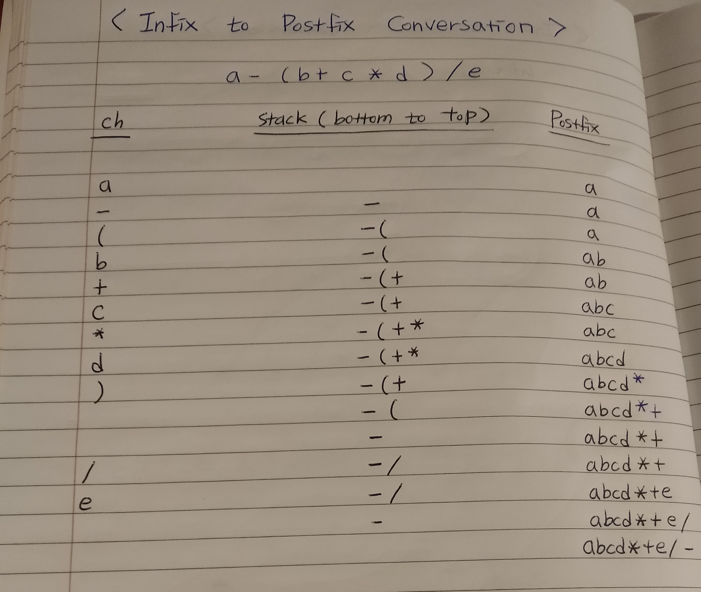
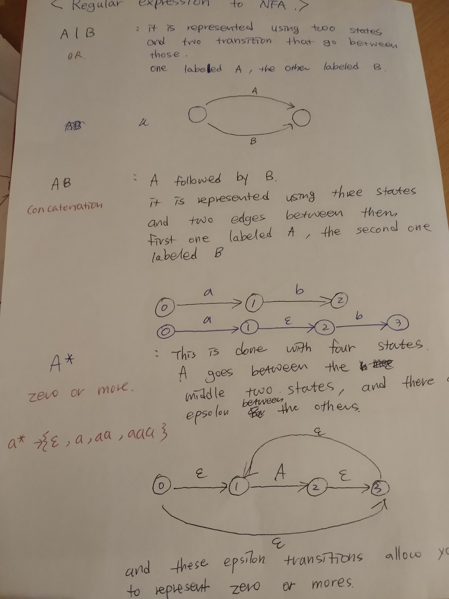
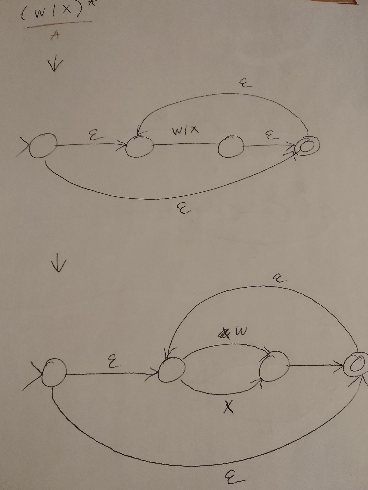
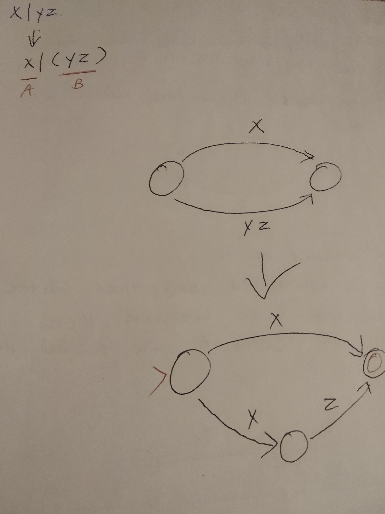
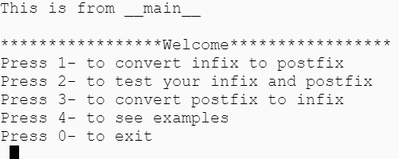
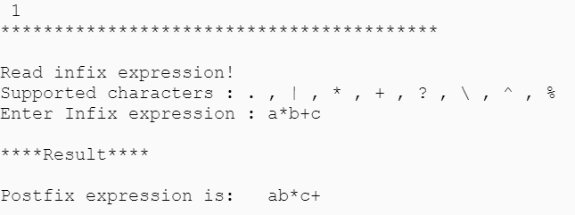
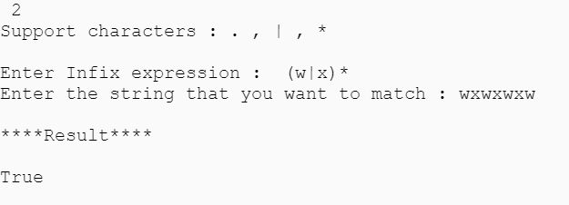
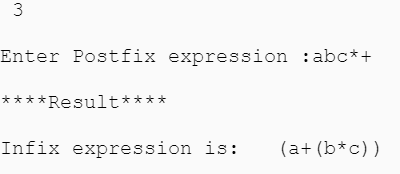
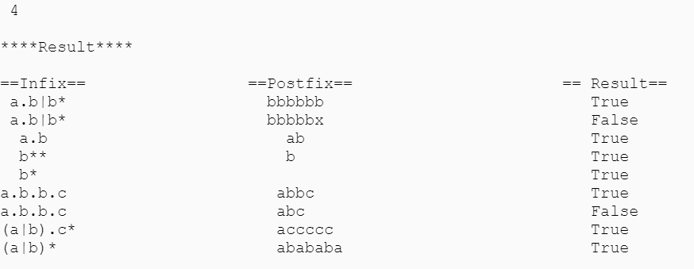

# Graph theory project

**Program in Python _to execute regular expressions on strings using an algorithm known as Thompson’s construction.
Thompsons' construction is used to convert a regular expression to a NFA. This NFA is then used to match a String against the original regular expression. The main goal of this project is to accept a regular expression with the special characters to match it against an input string from the user.**

#### Convert infix expression to postfix expression using Shunting yard algorithm.

1. Scan the infix expression from left to right.
2. If the scanned character is an operand, output it.
3. Else,
        3.1 If the precedence of the scanned operator is greater than the precedence of the operator in the stack(or the stack is empty or the stack contains a ‘(‘ ), push it.
        3.2 Else, Pop all the operators from the stack which are greater than or equal to in precedence than that of the scanned operator. After doing that Push the scanned operator to the stack. 
         (If you encounter parenthesis while popping then stop there and push the scanned operator in the stack.)
4. If the scanned character is an ‘(‘, push it to the stack.
5. If the scanned character is an ‘)’, pop the stack and and output it until a ‘(‘ is encountered, and discard both the parenthesis.
6. Repeat steps 2-6 until infix expression is scanned.
7. Print the output
8. Pop and output from the stack until it is not empty.

The program will ask the user if they want to...
     1. ..get postfix expression from the user input ( infix expression )  or
     2. ..test if the user's inputs are matched ( the user's input will be both infix and postfix expression)

(The user can just type infix regular expression to get porstfix regular expression, 
 or
 the user can type both infix expression and postfix expression to test if they are matched.

## Elements of this project
#
## NFA (Non-deterministic Finite Automaton)
**NFA stands for non-deterministic finite automata.
The finite automata are called NFA when there exist many paths for specific input from the current state to the next state.
Every NFA is not DFA, but each NFA can be translated into DFA.
Non-deterministic finite automata can have any number of arrows for each state and symbol.
A finite automaton is a collection of 5-tuple (Q, ∑, δ, q0, F), where:**
#### Q: finite set of states  
#### ∑: finite set of the input symbol  
#### q0: initial state   
#### F: final state  
#### δ: Transition function
#
## Regular Expression
##### https://docs.python.org/3/library/re.html
##### https://docs.python.org/3/howto/regex.html#regex-howto
**A regular expression is a special sequence of characters that helps you match or find other strings or sets of strings, using a specialized syntax held in a pattern. Regular expressions are widely used in UNIX world. The Python module re provides full support for Perl-like regular expressions in Python.**
#####
## ======The special characters are:======
## 1) . 
##### (Dot.) In the default mode, this matches any character except a newline. If the DOTALL flag has been specified, this matches any character including a newline.
## 2) * 
##### Causes the resulting RE to match 0 or more repetitions of the preceding RE, as many repetitions as are possible. ab* will match ‘a’, ‘ab’, or ‘a’ followed by any number of ‘b’s.
## 3) | 
##### A|B, where A and B can be arbitrary REs, creates a regular expression that will match either A or B. An arbitrary number of REs can be separated by the '|' in this way. This can be used inside groups (see below) as well. As the target string is scanned, REs separated by '|' are tried from left to right. When one pattern completely matches, that branch is accepted. This means that once A matches, B will not be tested further, even if it would produce a longer overall match. In other words, the '|' operator is never greedy. To match a literal '|', use \|, or enclose it inside a character class, as in [|].
## 4) +
##### Causes the resulting RE to match 1 or more repetitions of the preceding RE. ab+ will match ‘a’ followed by any non-zero number of ‘b’s; it will not match just ‘a’.
## 5) ?
##### Causes the resulting RE to match 0 or 1 repetitions of the preceding RE. ab? will match either ‘a’ or ‘ab’.
#
## Thompsons' Construction
#### 
#### In computer science, Thompson's construction algorithm, also called the McNaughton-Yamada-Thompson algorithm, is a method of transforming a regular expression into an equivalent nondeterministic finite automaton (NFA). This NFA can be used to match strings against the regular expression. This algorithm is credited to Ken Thompson.
#### Algorithm to construct an Non-deterministic Finite Automaton (NFA) from a regular expression. NFA will recognise the same language as the regular expression

# How to get postfix from infix expression

# regular expression to NFA

# 

# User guide
### When running the program, the user gets a list of menu options. To select a menu option, enter the corresponding number for the user preference.

 ### option 1. This allows the user enter infix regular expression and this program will output post regular expression
          (This wasn't what the project asked for, but I just added for the user preference)
          

         

 ### option 2. This allows the user enter infix and postfix regular expression and this program check if they are matched or not.
 

 

 ### option 3. This allows the user enter postfix regular expression and this program will output infix regular expression
          (This wasn't what the project asked for, but I just added for the user preference)
          

       

 ### option 4. This allows the user to see examples of output

       

 
### How I got this project done.
#### I watech one or two videos each week posted on Moodle, and I just made sure that I understood them.
#### We didn't do anything with Python before, so since I started this module, I've been trying to do some small exercises to be familiar with this new language.
#### Researches, watching youtube videos definitely helped me a lot to understand better.

# References
 - https://www.w3schools.com/python/python_regex.asp (To learn about regular expression)
 - https://realpython.com/   (To learn about python) 
 - https://www.geeksforgeeks.org/infix-to-postfix-using-different-precedence-values-for-in-stack-and-out-stack/?ref=rp
 - https://www.geeksforgeeks.org/stack-set-2-infix-to-postfix/
 - https://www.includehelp.com/c/infix-to-postfix-conversion-using-stack-with-c-program.aspx   //converting infix expression to postfix
 - https://www.codeproject.com/Articles/405361/Converting-Postfix-Expressions-to-Infix          //converting postfix expression to infix
 - https://deniskyashif.com/2019/02/17/implementing-a-regular-expression-engine/
 - https://docs.python.org/3/library/sys.html (System-specific parameters and functions)
 - https://docs.python.org/3/library/getopt.html  (C-style parser for command line options)
 - https://docs.python.org/3/library/argparse.html  (Parser for command-line options, arguments and sub-commands)
 - https://docs.python.org/3/howto/argparse.html  (Argparse Tutorial)
 - https://stackabuse.com/command-line-arguments-in-python/  (Command Line Arguments)
 
