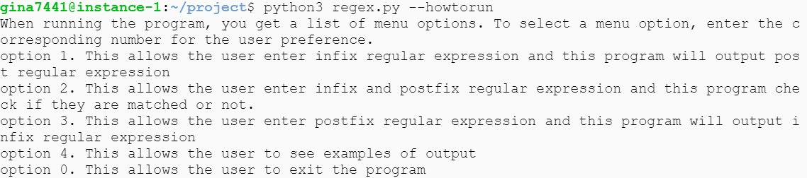

# Graph theory project

## Introduction
Program in Python _to execute regular expressions on strings using an algorithm known as Thompson’s construction. Thompsons' construction is used to convert a regular expression to a NFA. This NFA is then used to match a String against the original regular expression. The main goal of this project is to accept a regular expression with the special characters to match it against an input string from the user.
# 
## Setup
Developed and tested in python
https://github.com/JinaKim77/project.git
# 
## how to install Python
Check this link.
https://realpython.com/installing-python/
1.	Open a browser window and navigate to the Download page for Windows at python.org.
2.	Underneath the heading at the top that says Python Releases for Windows, click on the link for the Latest Python 3 Release - Python 3.x.x. (As of this writing, the latest is Python 3.6.5.)
3.	Scroll to the bottom and select either Windows x86-64 executable installer for 64-bit or Windows x86 executable installer for 32-bit. 
# 
## How to run 
#### ⬤ First, clone the repository using the following command git clone https://github.com/JinaKim77/project.git
## 
#### ⬤ Traverse using the command line to the folder you have cloned using the cd command.
## 
#### ⬤ From the command line run the following command to run the programs. python3 project.py
# 
## Test
This program  accept command line arguments.

### --help or -h : guides users how to run the program

### --version or -V : displays program version

### --description or -D : display program descriptions 

### --howtorun or -H : display how to run this program

### --regex or -R : explain what the regular expression is

## User guide

1. Firstly, when running the program, the user get a list of menu options.
   To select a menu option, enter the corresponding number for the user preference.
   As the main purpose of the program (project) is to match text string to infix regular expression,
   the user will enter infix regular expression that they want to check if it matches a string of        text. The expression should include any of the following special characters.
   
   #### ⬤ . : Concatenation operator. ( e.g. a.b : a followed by b )
   #### ⬤ | : Or operator. ( e.g. a|b : an a or a b
   #### ⬤ * : zero or more ( e.g. a* : any number of a's, including zero )
   #### ⬤ ? : zero or one
   #### ⬤ + : one or more
   
 2. Then the program will ask the user to enter string that they want to check.

 3. The program will output a True or False as to whether the string was matched against the             expression.

## Infix to postfix algorithm
The regex is read in infix notations that needs to be converted to postfix notation.

#### while there are more symbols to be read
#### if
#### -  operand  -> output it.
#### -    ')'    -> push it on the stack
#### -    '('    -> pop operatiors from the stack to the output until a ')' is popped.
#### -              you should make sure you do not output either of the parentheses.
#### -  operator -> pop highter or equal precedence operators from the stack to the output.
#### -              stop before popping a lower precedence operator or a ')'.
#### -              push the operator on the stack.
#### end if
#### end while
#### pop the remaining operators from the stack to the output

#

## The Shunting Yard Algorithm
#### "Shunting Yard" algorithm to convert an infix expression into a postfix expression. 
#### It uses a stack; but in this case, the stack is used to hold operators rather than numbers.
#### The purpose of the stack is to reverse the order of the operators in the expression. 
#### It also serves as a storage structure, since no operator can be printed until both of its operands have appeared.
#### In this algorithm, all operands are printed (or sent to output) when they are read. 

#

## Rules
#### 1. If the incoming symbols is an operand, print it..

#### 2. If the incoming symbol is a left parenthesis, push it on the stack.

#### 3. If the incoming symbol is a right parenthesis: discard the right parenthesis, pop and print the stack symbols until you see a left parenthesis. 
#### Pop the left parenthesis and discard it.

#### 4. If the incoming symbol is an operator and the stack is empty or contains a left parenthesis on top, push the incoming operator onto the stack.

#### 5. If the incoming symbol is an operator and has either higher precedence than the operator on the top of the stack, 
#### or has the same precedence as the operator on the top of the stack and is right associative -- push it on the stack.

#### 6. If the incoming symbol is an operator and has either lower precedence than the operator on the top of the stack, or has the same precedence as the operator on the top of the stack and is left associative -- continue to pop the stack until this is not true. Then, push the incoming operator.

#### 7. At the end of the expression, pop and print all operators on the stack. (No parentheses should remain.)

# 
## Thompson's construction - Converting a regular expression to a NFA 
#### Thompson's construction algorithm, also called the McNaughton-Yamada-Thompson algorithm, is a method of transforming a regular expression into an equivalent nondeterministic finite automaton (NFA).This NFA can be used to match strings against the regular expression.
#### The algorithm works recursively by splitting an expression into its constituent subexpressions, from which the NFA will be constructed using a set of rules. More precisely, from a regular expression E, the obtained automaton A with the transition function δ respects the following properties:
#####  A has exactly one initial state q0, which is not accessible from any other state. 
##### A has exactly one final state qf, which is not co-accessible from any other state.
##### The number of transitions leaving any state is at most two.

# 
 
## References
#### ⬤ https://realpython.com/ (To learn about python)
#### ⬤ https://www.geeksforgeeks.org/infix-to-postfix-using-different-precedence-values-for-in-stack-and-out-stack/?ref=rp
#### ⬤ https://www.geeksforgeeks.org/stack-set-2-infix-to-postfix/
#### ⬤ https://www.includehelp.com/c/infix-to-postfix-conversion-using-stack-with-c-program.aspx //converting infix expression to postfix
#### ⬤ https://www.codeproject.com/Articles/405361/Converting-Postfix-Expressions-to-Infix //converting postfix expression to infix
#### ⬤ https://deniskyashif.com/2019/02/17/implementing-a-regular-expression-engine/
#### ⬤ https://docs.python.org/3/library/sys.html (System-specific parameters and functions)
#### ⬤ https://docs.python.org/3/library/getopt.html (C-style parser for command line options)
#### ⬤ https://docs.python.org/3/library/argparse.html (Parser for command-line options, arguments and sub-commands)
#### ⬤ https://docs.python.org/3/howto/argparse.html (Argparse Tutorial)
#### ⬤ https://stackabuse.com/command-line-arguments-in-python/ (Command Line Arguments)

